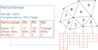
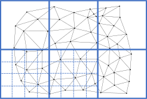
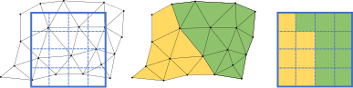

**********************************
Overaching Concepts and Motivation
**********************************

Introduction
============

NESO-Particles (NP) is a particle library designed to enable particle transport over unstructured, and potentially high-order, meshes in a performance portable implementation.
:numref:`mesh-with-coarse` illustrates an example mesh in black.
In parallel computation such unstructured meshes are typically decomposed across many MPI ranks where each rank stores and can access a relatively small proportion of the overall mesh.
In Finite Element Methods (FEM) such meshes are used in conjunction with finite elements to define function spaces on which numerical solutions to Partial Differential Equations (PDEs) can be sought.

.. _mesh-with-coarse:

   Unstructured mesh (black) with coarse overlay grid (blue).

Of particular interest is the class of Particle In Cell (PIC) algorithms that seek to numerically solve PDEs via mesh and particle based approximations.
In these PIC schemes data is transferred between particle and mesh based representations at each time step and this data transfer may account for a significant proportion of the overall runtime.
This implementation supports storing particle data on a per cell basis to allow efficient coupling between mesh and particle representations.

An additional challenge this implementation tackles is the efficient transfer of particles between the subdomains that result from the domain decomposition approach.
There are numerous methods for tracking particles between cells, none of which are computationally cheap.
Mapping arbitrary points in space to cells in the mesh, and other methods to track particles, is particularly expensive on an unstructured, and potentially high-order, mesh. 
In contrast to typical Molecular Dynamics (MD) implementations we implement particle transfer mechanisms that can transfer particles "globally" as to accommodate very fast moving particles.

Particle Data
=============

NESO-Particles is designed to store particle data in a per cell manner but does not have a concept of what a cell is other than an integer index.
This abstraction allows downstream code to define what a cell is for that use case.
For example in NESO a cell is a Nektar++ mesh geometry object.
We assume that there are :math:`N_{cell}` cells on each MPI rank that are indexed :math:`0` to :math:`N_{cell}-1`.

In NP particles are stored within a :class:`ParticleGroup` instance which is constructed with a physical domain, a particle specification and a compute device.
Typically the data a user wishes to store per particle is dependent on their particular simulation.
NP allows, and expects, users to define the properties each particle holds in the specification of the particle.
Each property is defined with a datatype (either REAL or INT), a number of components and a label (string).
For example an INT property of 1 component could store particle identity or a REAL property of 3 components could store velocities.

NP demands that there exists a REAL valued property with component number equal to the dimension of the domain which stores particle positions such that particles can be mapped into cells.
These cell identities (in :math:`[0, N_{cell} -1]`) are stored in the second mandatory property which is a INT property of 1 component.
The name given to these position and cell index properties is user choice.

.. _particle_data_overview:

   Overview of per cell particle data within a ParticleGroup.

Figure :numref:`particle_data_overview` illustrates 4 particle properties within a :class:`ParticleGroup`.
The data for these properties is stored in a cell-wise manner within a :class:`ParticleDat` object.
The :class:`ParticleDat` is responsible for managing the device memory which stores the particle data and for providing access methods which the user can call to access the underlying particle data.

The :class:`ParticleGroup` object uses the domain instance along with the particle positions to determine which cell particles reside in.
Once cell indices are determined the :class:`ParticleGroup` moves particle data between the storage location for each cell.
Within each cell data is stored such that the particle data is stored contiguously component-wise (SoA layout).

The :class:`ParticleGroup` also uses the position information to determine when particle data should be transferred to a different remote MPI rank.
NESO-Particles uses a combination of a local exchange pattern a global communication pattern to enable global transfer (i.e. anywhere to anywhere) of particles over an unstructured (and potentially high-order) mesh.
Furthermore the local exchange pattern is configurable to promote particle transfer through local communications where possible.

Transfer of Particle Data Globally
----------------------------------

An unstructured mesh makes determining exactly which MPI rank owns a region of space particularly challenging. 
In a particle code particles are free to leave the sub-domain owned by an MPI rank in any direction and potentially with a very high velocity.
To determine which MPI rank should be assigned a particle when it leaves a sub-domain we employ an approach that combines a coarse structured mesh with halo cells.

First a coarse mesh of squares is constructed that covers the global unstructured mesh.
Each square in this coarse mesh is then subdivided to a given order to produce a finer structured mesh (in future this could be replaced with a standard octree).
An illustration of this coarse mesh with subdivision is presented in Figure :numref:`mesh_overlay`.

.. _mesh_overlay:

   Unstructured global mesh with coarse mesh overlay and an order 2 sub-division.

This structured mesh gives a computationally cheap approach to map a region of space to MPI ranks that could own that region of the computational domain the particle resides in.
To determine exactly which MPI rank owns the point the particle resides at each we first determine a unique MPI ranks that owns each fine cell in the structured mesh.
MPI rank assignment of the structured mesh is determined based on approximate overlap between structured mesh cell and the sub-domain of the unstructured mesh owned by the MPI rank.

.. _mesh_overlay_assign:

   Region of the global unstructured mesh featuring two MPI ranks (yellow and green) with inter-rank boundary.

Figure :numref:`mesh_overlay_assign` illustrates the resulting ownership pattern that could occur at the boundary between two MPI ranks.
Note that due to the unstructured nature of the computational mesh there will always be a disparity between the computational unstructured mesh and the structured mesh that we overlay.
We can use the coarse structured mesh to determine the MPI rank that owns the structured mesh cell and send the particle information to that MPI rank (using MPI3 RMA) but that receiving rank must be able to map all points in the structured mesh cells it owns to unstructured mesh cells on the original mesh.
We build this map by extending the locally owned portion of the unstructured mesh with copies of all mesh cells that have an non-zero overlap with the owned structured mesh cells.

.. _mesh_build_halo:
.. figure:: figures/mesh_build_halo.svg
   :class: with-border
   :height: 240 pt

   Region of the global unstructured mesh featuring owned by an MPI rank (yellow) extended with halo cells from a neighbouring MPI rank (green).

In Figure :numref:`mesh_build_halo` the locally owned sub-domain in yellow is extended with halo cells from the neighbouring rank (green) such that all owned cells in the structured mesh are entirely covered by unstructured mesh elements.
We assume that the copied elements are also tagged with the original owning rank (and the index of that cell on the remote rank).
Hence when an MPI rank receives a particle through the global transfer mechanism the particle either exists on a locally owned mesh cell and is kept or exists on a halo mesh cell (of known owner) and is sent to the MPI rank that owns the halo element.

An overview of the global transfer algorithm is as follows:

1. Loop over all local particles:

   1. If the particle is within the sub-domain keep the particle.
   2. If the particle is in a halo cell push the particle onto the set of particles to send to that remote rank using point to point local transfer.
   3. Otherwise determine the MPI rank that owns the overlayed structured mesh cells and push the particle onto the set of particle indices to send to that remote rank though the global communication mechanism.
2. Exchange particles that must be exchanged using the global transfer mechanism (one sided MPI RMA).
3. Loop over particles received though the global exchange:

   1. If the particle is within the sub-domain keep the particle.
   2. If the particle is in a halo cell push the particle onto the set of particles to send to that remote rank using point to point local transfer.
4. Perform local point-to-point transfer of particles between neighbouring MPI ranks.
